#Getting Started

To set up Cloyster in your environment, you must first download the project in the head node.

##System Requirements

Before you attempt to run Cloyster, make sure your head node meet the minimum requirements.

###Minimum Hardware Requirements

####Head node

- Half of system CPU cores as vCPU
- At least 4GB of RAM
- 50GB of Disk
- 2 Network Interfaces
- External Access
- Internal Management Network
- Disable side channel mitigations (for performance reasons)
- UEFI mode

###Operating System Requirements

- EL8 based system with minimal package selection

---
##Assembling an answerfile

Cloyster' TUI answerfile (used only in the TUI (Terminal user interface) ) is a INI-based file that contains settings definitions and values used during Cloyster execution. In the following example answerfile, you specify various options (some options are obligatory and some optional). These options include the cluster information, time values, networking (external, management and application networks}, desired system iso file and the nodes to be used within the cluster.

###Information

This section requires information about your cluster and your company.

```
[information]  
cluster_name=cloyster  
company_name=cloyster-enterprises  
administrator_email=foo@example.com
```

###Time

This section requires the cluster timezone, timeserver and locale.

```
[time]  
timezone=America/Sao_Paulo  
timeserver=0.br.pool.ntp.org  
locale=en_US.UTF-8 # Must follow the desired OS supported locales.
```

###Hostname

This section requires your machine hostname and domain name.

```
[hostname]  
hostname=cloyster  
domain_name=cluster.example.com
```

###Networks

This section requires information about the cluster networks.

[External]
: This network is used by the management node to control the nodes out of band via the SP like BMC, FSP. If the BMCs are configured in shared mode, then this network can be combined with the management network..

[Management]
: This network is used by the management node to install and manage the OS of the nodes. The MN and in-band NIC of the nodes are connected to this network. If you have a large cluster with service nodes, sometimes this network is segregated into separate VLANs for each service node.

[Application]
: This network is used by the applications on the compute nodes. Usually an IB network for HPC cluster..

####External

```
# Cloyster must have an external network  
[network_external]  
interface=enp1s0  
#ip_address=172.16.144.0  
#subnet_mask=255.255.255.0  
#network_address=172.16.144.1  
#gateway=192.168.122.1  
#domain_name=example.com  
#nameservers=146.164.36.7,146.164.36.15  
#mac_address=de:ad:be:ff:00:00
```

####Management

```
# Cloyster must have an management network  
[network_management]  
interface=enp8s0  
ip_address=172.26.255.254  
subnet_mask=255.255.0.0  
network_address=172.26.0.0  
#gateway=172.26.0.1
domain_name=cluster.example.com
#nameservers=172.26.0.1  
#mac_address=de:ad:be:ff:00:01
```

####Application

```
# Use the network_application if using a Infiniband  
# Must inform all options if enabled  
#[network_application]  
#interface=ib0  
#ip_address=172.26.0.0  
#subnet_mask=255.255.0.0  
#network_address=172.26.0.1  
#gateway=0.0.0.0  
#domain_name=cloysterhpc.example  
#nameservers=0.0.0.0,0.0.0.0  
#mac_address=de:ad:be:ff:00:01
```


###System

This section requires information about the path to an iso disk image with your desired OS.

```
[system]  
# Full path to the disk image  
disk_image=/root/OracleLinux-R8-U7-x86_64-dvd.iso
```


###Nodes

This section requires information about your nodes. If you need to add more than one mac address, use a comma to separate. 

```
[nodes]
prefix=n
padding=2
node_start_ip=172.26.0.1
mac_addresses=ca:fe:de:ad:be:ef
node_root_password=pwd
sockets=1
cores_per_socket=1
threads_per_core=1
```

###Example of an answerfile

```
# Example answerfile model to use with Cloyster.

[information]
cluster_name=cloyster
company_name=cloyster-enterprises
administrator_email=foo@example.com

[time]
timezone=America/Sao_Paulo
timeserver=0.br.pool.ntp.org
locale=en_US.UTF-8

[hostname]
hostname=cloyster
domain_name=cluster.example.com

# Cloyster must have an external network
[network_external]
interface=enp1s0
#ip_address=172.16.144.0
#subnet_mask=255.255.255.0
#network_address=172.16.144.1
#gateway=192.168.122.1
#domain_name=example.com
#nameservers=146.164.36.7,146.164.36.15
#mac_address=de:ad:be:ff:00:00

# Cloyster must have an management network
[network_management]
interface=enp8s0
ip_address=172.26.255.254
subnet_mask=255.255.0.0
network_address=172.26.0.0
#gateway=172.26.0.1
domain_name=cluster.example.com
#nameservers=172.26.0.1
#mac_address=de:ad:be:ff:00:01

# Use the network_application if using a Infiniband
# Must inform all options if enabled
#[network_application]
#interface=ib0
#ip_address=172.26.0.0
#subnet_mask=255.255.0.0
#network_address=172.26.0.1
#gateway=0.0.0.0
#domain_name=cloysterhpc.example
#nameservers=0.0.0.0,0.0.0.0
#mac_address=de:ad:be:ff:00:01

[system]
# Full path to the disk image
disk_image=/root/OracleLinux-R8-U7-x86_64-dvd.iso

[nodes]
prefix=n
padding=2
node_start_ip=172.26.0.1
mac_addresses=ca:fe:de:ad:be:ef
node_root_password=pwd
sockets=1
cores_per_socket=1
threads_per_core=1
```

---
#Running Cloyster

###Help

You can read a full commands list by running on your terminal the command below: 
`./cloyster -h`

##Using the Terminal User Interface

Cloyster' TUI runs in a terminal with an preassembled [answerfile](#assembling-an-answerfile

###Commands

To run Cloyster with an answerfile you must use the command below:
`./cloyster -a /path/to/answerfile.ini`

Read section "[Assembling an answerfile](#assembling-an-answerfile)" if needed.

##Using the Graphical User Interface

Cloyster' GUI runs in a terminal, without an answerfile, with guided installation divided into different categories that will be explained in the subsection below.

###Guided installation example

####General Cluster settings

The installation starts after this screen.

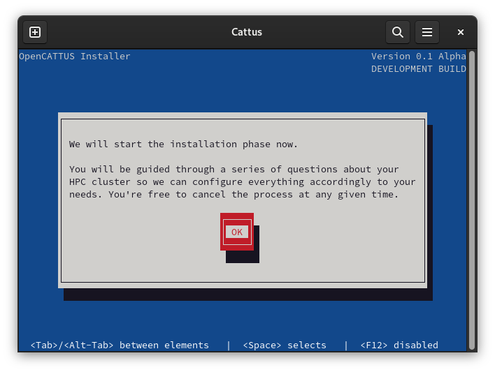

Press ok to start the installation.

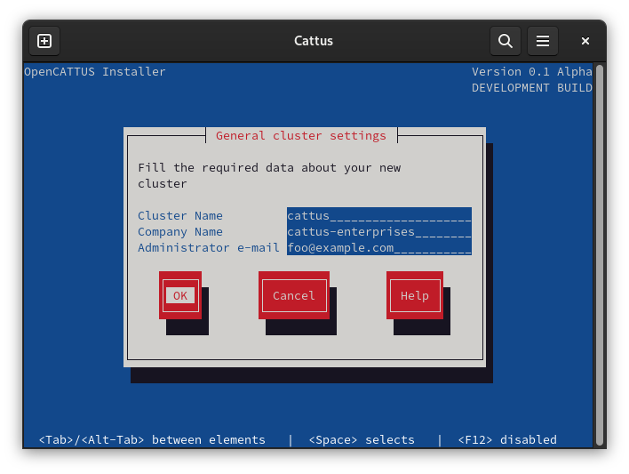

Here you must insert your cluster name, company name and administrator email.

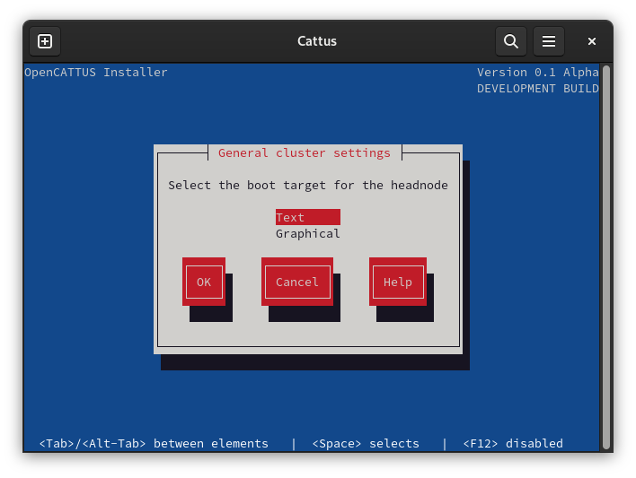

####Time and clock settings


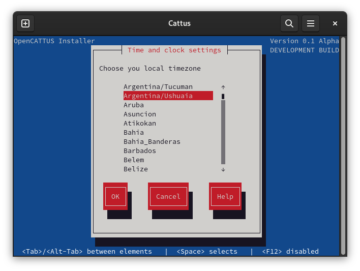


####Locale settings

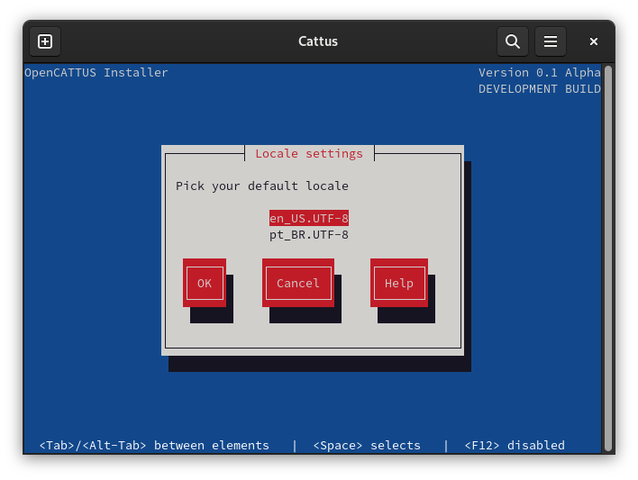

####Hostname settings

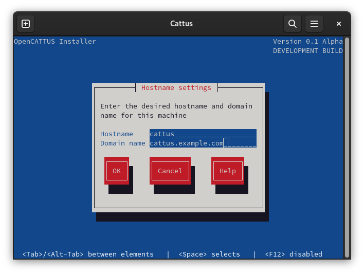

####Network settings

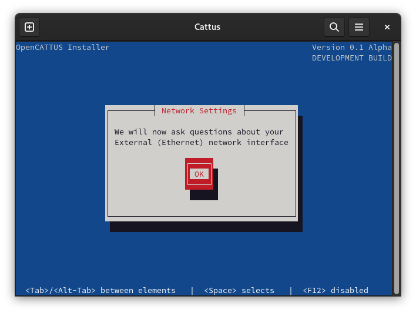


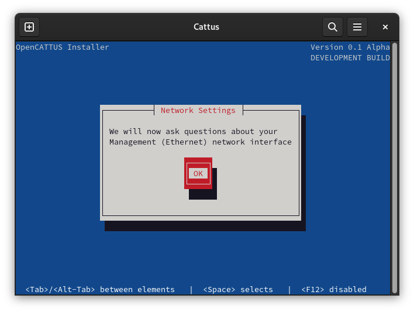

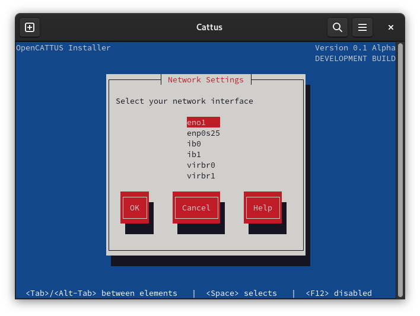

After this, you must fill the details (same as figure 2.11).


####Nodes operational system settings


If 'YES':

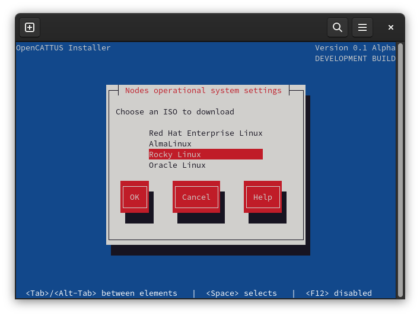

If 'NO':

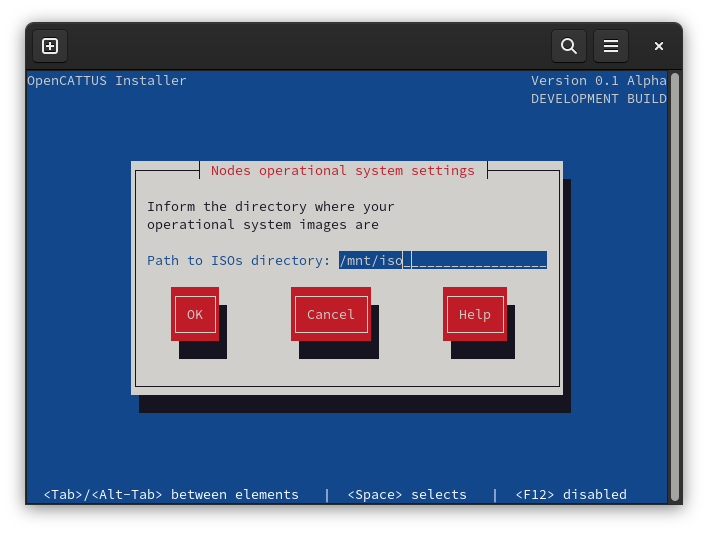


####Compute nodes settings

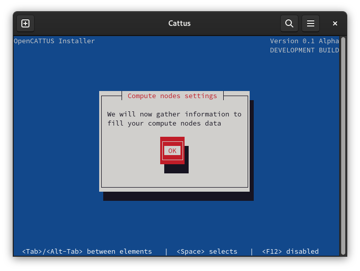


####Queue system settings

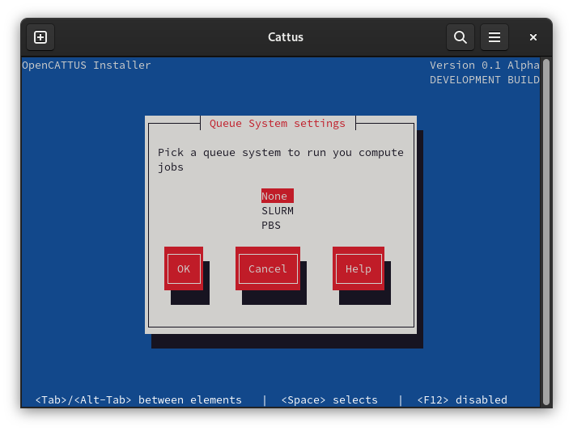

####Mail system settings


