.. _tui-installation:

=========================================================
Installation Guide for Terminal Text-based User Interface
=========================================================

To set up Cloyster in your environment, you must first download the project in the head node.

For the current list of operating systems supported and minimum requirements, read section ":doc:`System Requirements <../../overview/sys_os_requirements>`"

Cloyster' TUI runs in a terminal, without an answerfile, with guided installation divided into different categories that will be explained in the subsection below.

Guided Installation
---------------------------

General Cluster settings
~~~~~~~~~~~~~~~~~~~~~~~~

The installation starts after this screen.
Press OK to start the installation.

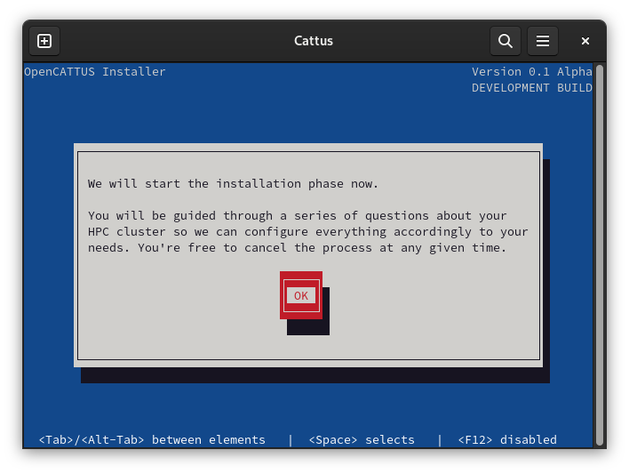

Here you must insert your cluster name, company name, and administrator email.

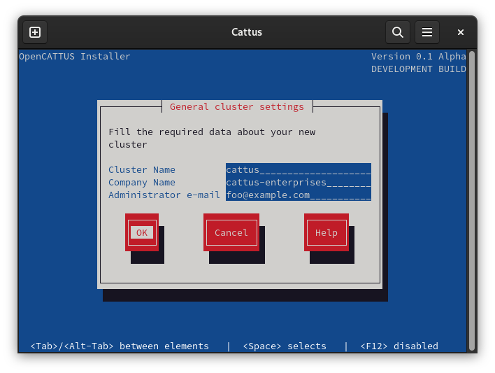

And you must select the boot target.

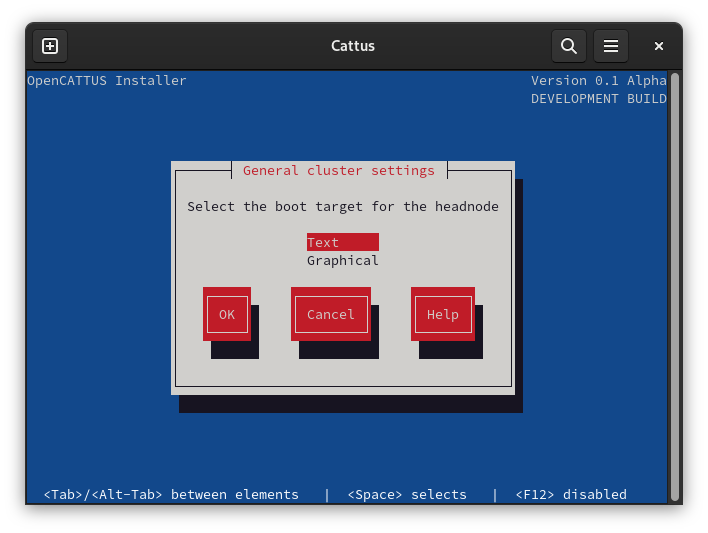

Time and clock settings
~~~~~~~~~~~~~~~~~~~~~~~~~~~

Select your local timezone, searching through your continent and country/state.

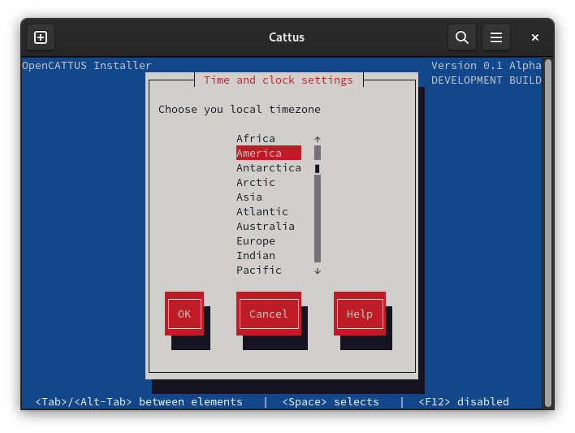

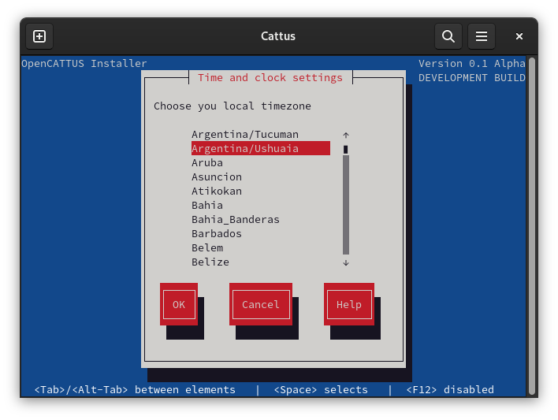

Select the time servers for your region, according to the available servers listed in `ntppool <https://www.ntppool.org>`_.

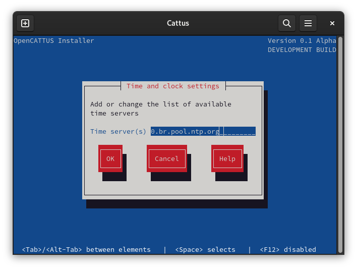

Locale settings
~~~~~~~~~~~~~~~~~

Select the appropriate default locale (used by programs or libraries for rendering text, correctly displaying regional
monetary values, time and date formats, alphabetic 	idiosyncrasies, and other locale-specific standards).

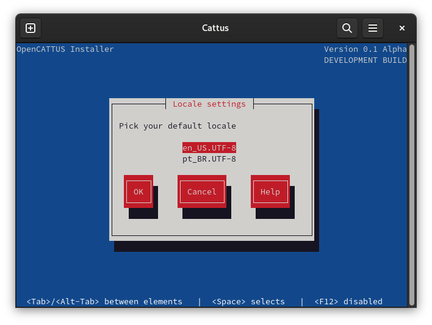

Hostname settings
~~~~~~~~~~~~~~~~~~

Enter the machine hostname and domain name.

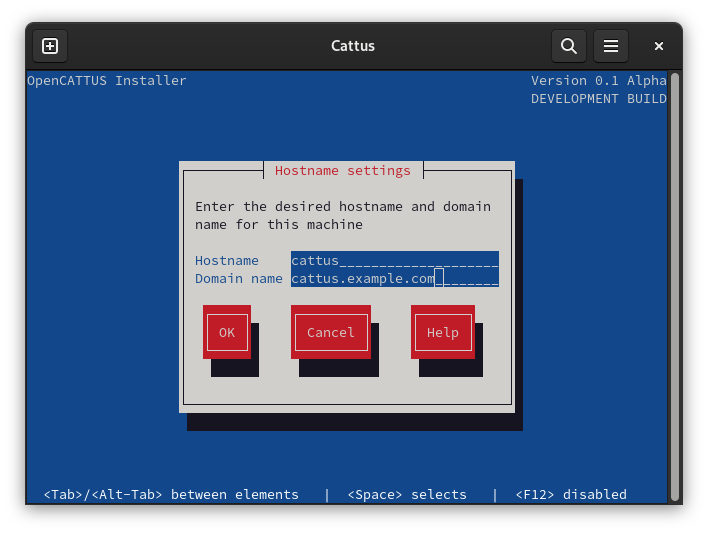

Network settings
~~~~~~~~~~~~~~~~~~

Fill in the information regarding the machine's external network.

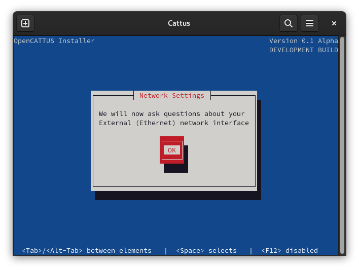

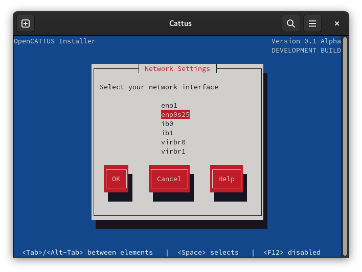

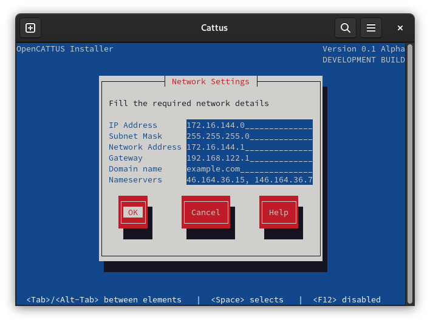

Fill in the information regarding the machine's internal management network.

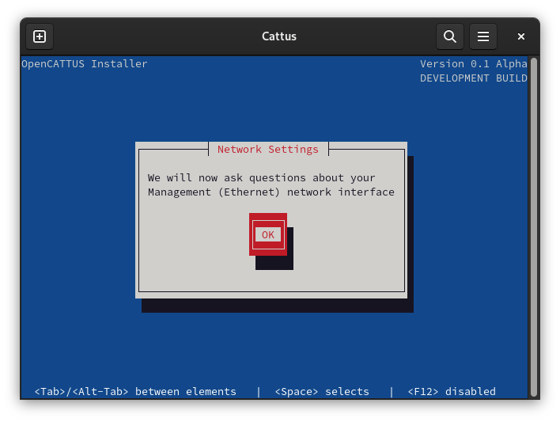

If you have an available Infiniband Fabric, also fill in the information as done previously for other networks.

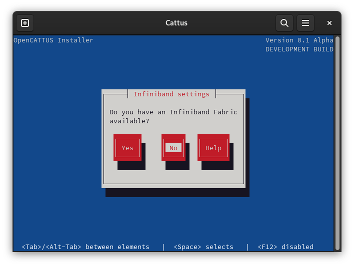

Nodes operational system settings
~~~~~~~~~~~~~~~~~~~~~~~~~~~~~~~~~~

For provisioning images to the computational nodes, choose if you want to download an ISO or use a local image:

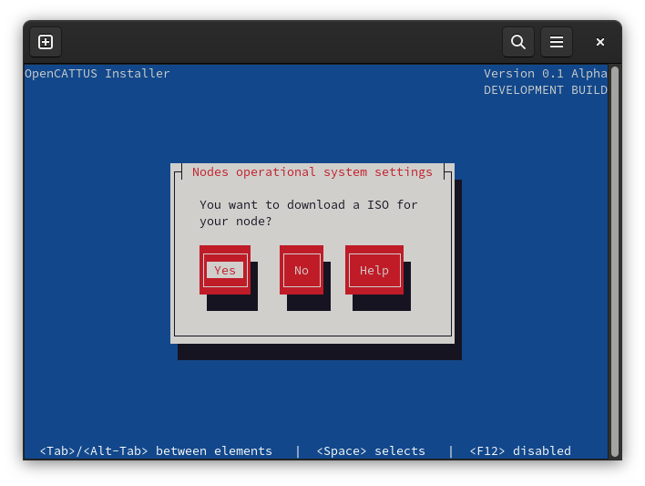

If 'YES':
Select the desired operating system.

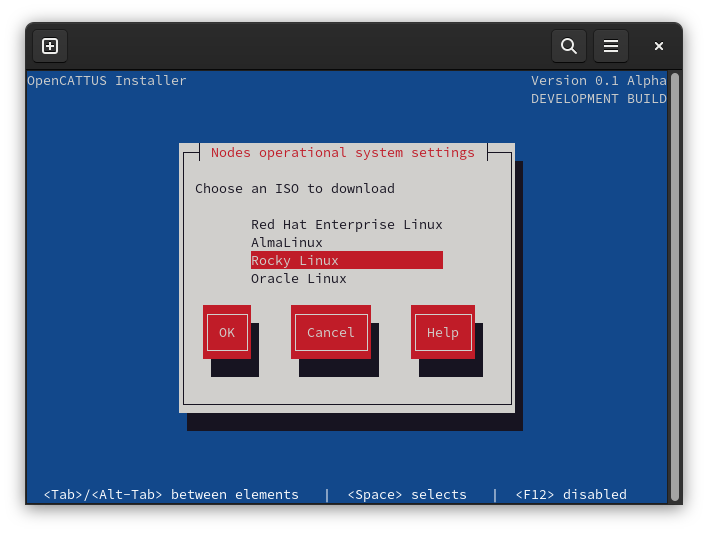

If 'NO':
Provide the directory where the local ISO is located.

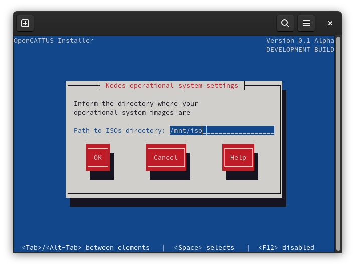

Select the operating system of the ISO.

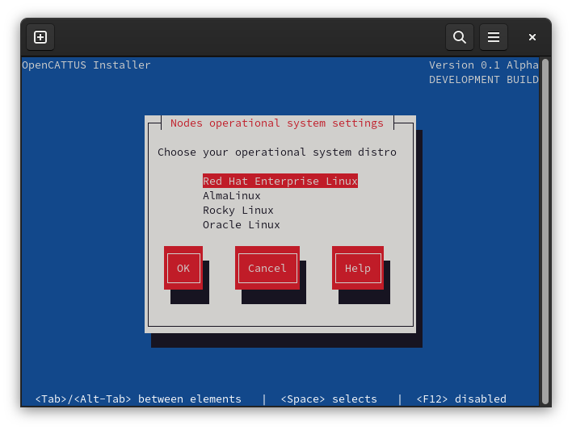

Provide the name of the ISO file.

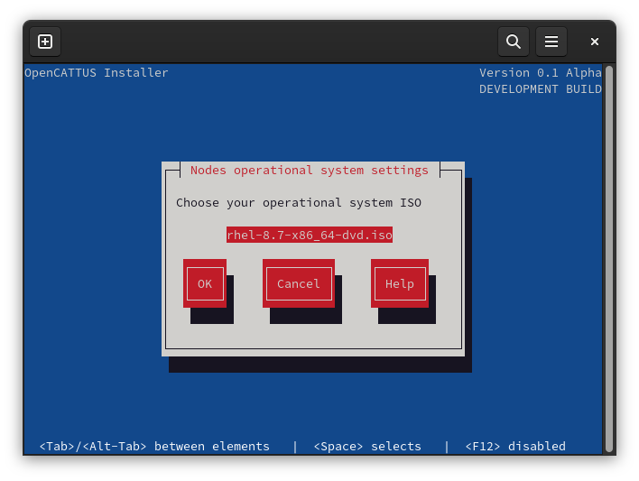

Compute nodes settings
~~~~~~~~~~~~~~~~~~~~~~~~

Press OK to fill your compute nodes data.

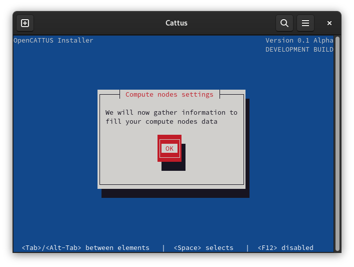

Enter the information for the nodes as requested.

Examples:

- prefix=n, padding=2 (n01, n02, n03, nXX)
- Compute node first IP

    - n01: 172.26.0.1
    - n02: 172.26.0.2
    - nXX: 172.26.0.XX

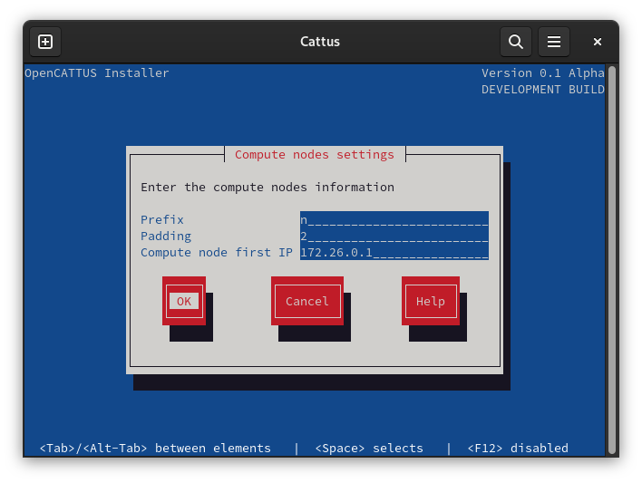

Enter each node MAC address.

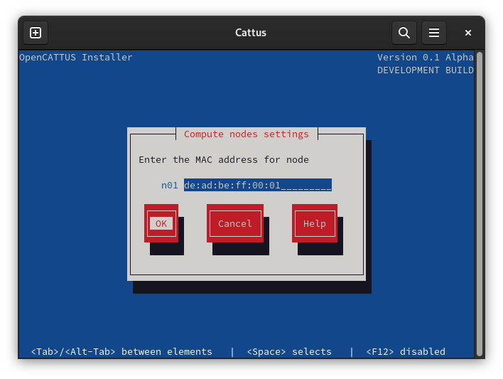

Queue system settings
~~~~~~~~~~~~~~~~~~~~~~~~

Select the desired queue system (`SLURM <https://slurm.schedmd.com/>`_ or `PBS <https://www.openpbs.org/>`_).

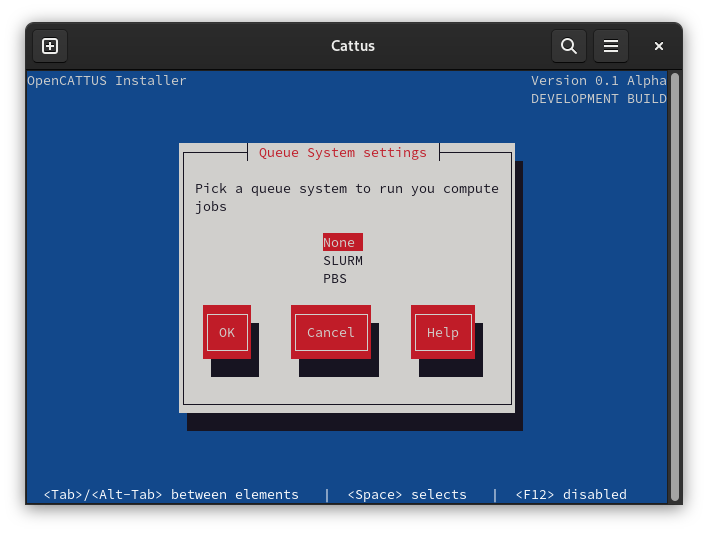

Mail system settings
~~~~~~~~~~~~~~~~~~~~~~~~

Choose if you want to enable Postfix mail system or no.

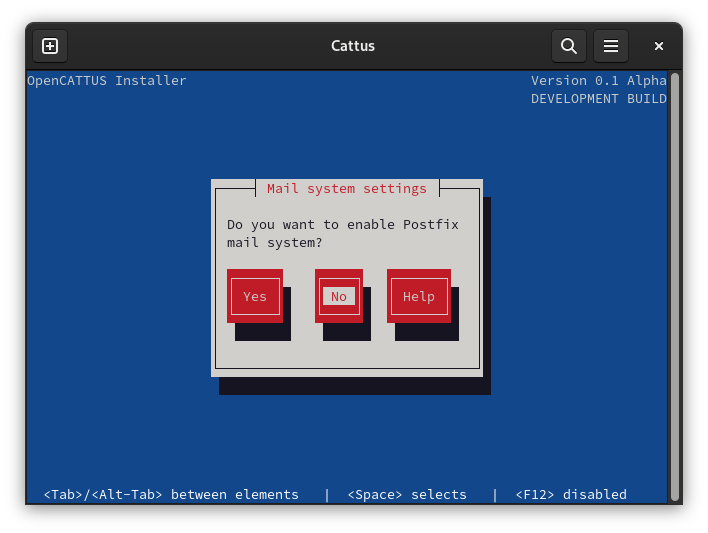
